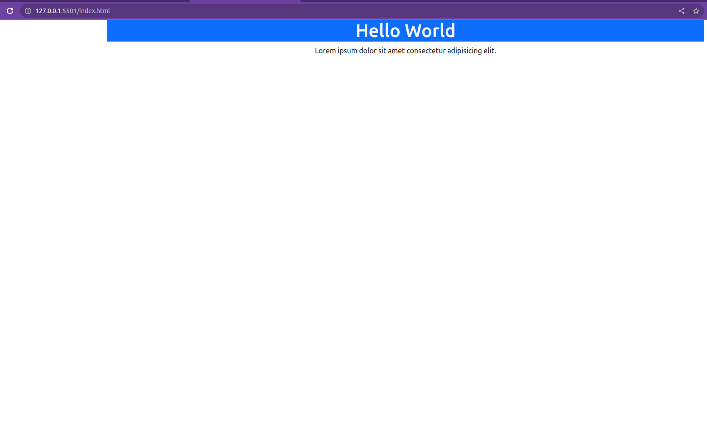

- [The Bootstrap Blog Project](#the-bootstrap-blog-project)
  - [Description](#description)
  - [Setting up Bootstrap 5.3 in your project](#setting-up-bootstrap-53-in-your-project)
  - [](#)
  - [Adding components to the index.html file](#adding-components-to-the-indexhtml-file)
    - [Creating the Navbar Component](#creating-the-navbar-component)
    - [Adding the Hero section](#adding-the-hero-section)
    - [Adding the subscribe modal](#adding-the-subscribe-modal)
    - [Adding the Posts section](#adding-the-posts-section)
    - [Adding the footer section](#adding-the-footer-section)
    - [Adding blur effect to the navbar](#adding-blur-effect-to-the-navbar)
  - [Adding the card hover effect](#adding-the-card-hover-effect)
  - [final result](#final-result)

---

# The Bootstrap Blog Project


---

## Description

This project is built with Bootstrap 5.3.
It is a single page application with:

- a navbar
- a hero section
- a grid of cards and
- a footer.

---

## Setting up Bootstrap 5.3 in your project

1. Create a new project folder and open it in VS Code.
2. Create an index.html file and add the basic HTML structure. This file will serve as our home template. It should look like this:

```html
<!DOCTYPE html>
<html lang="en">
  <head>
    <meta charset="UTF-8" />
    <meta name="viewport" content="width=device-width, initial-scale=1.0" />
    <title>Document</title>
  </head>
  <body></body>
</html>
```

As a side tip, you can use the `!` shortcut to create the basic HTML structure. Just type `!` and hit the `Tab` key.:smiley:

3. Change the title to `Bootblog1.0` or any other name of your choice. The code will now look like this:

```html
<!DOCTYPE html>
<html lang="en">
  <head>
    <meta charset="UTF-8" />
    <meta name="viewport" content="width=device-width, initial-scale=1.0" />

    <title>Bootblog1.0</title>
  </head>
  <body></body>
</html>
```

4. Visit the [Boostrap homepage](https://getbootstrap.com/) and click on `Docs` on the navbar near the Bootrap icon.
5. On the page that appear ([Get started with Bootstrap](https://getbootstrap.com/docs/5.3/getting-started/introduction/)), click on the `CDN links` link on the menu that appears next to the right of the page.

---

## 

6. Copy the `CSS` link under the `CDN links` or from the example in step 2. It should look like this:

```js
<link href="https://cdn.jsdelivr.net/npm/bootstrap@5.3.0/dist/css/bootstrap.min.css" rel="stylesheet" integrity="sha384-9ndCyUaIbzAi2FUVXJi0CjmCapSmO7SnpJef0486qhLnuZ2cdeRhO02iuK6FUUVM" crossorigin="anonymous">
```

7. Paste the link in a `link` element above the title of the page in the `head` of the html document like this:

```html
<!DOCTYPE html>
<html lang="en">
  <head>
    <meta charset="UTF-8" />
    <meta name="viewport" content="width=device-width, initial-scale=1.0" />
    <!-- CSS CDN link   
    <link
      rel="stylesheet"
      href="https://cdn.jsdelivr.net/npm/bootstrap@5.3.0/dist/css/bootstrap.min.css"
    />
    -->
    <!-- OR CSS example link -->
    <link
      href="https://cdn.jsdelivr.net/npm/bootstrap@5.3.0/dist/css/bootstrap.min.css"
      rel="stylesheet"
      integrity="sha384-9ndCyUaIbzAi2FUVXJi0CjmCapSmO7SnpJef0486qhLnuZ2cdeRhO02iuK6FUUVM"
      crossorigin="anonymous"
    />
    <!-- rest of the code -->
  </head>
  <body></body>
</html>
```

8. Copy the `JS` link under the `CDN` link from the same location as the CSS link. It should look like this:

```
https://cdn.jsdelivr.net/npm/bootstrap@5.3.0/dist/js/bootstrap.bundle.min.js

```

9. Also add it to the html document below the css link tag as follows:

```html
<!DOCTYPE html>
<html lang="en">
  <head>
    <meta charset="UTF-8" />
    <meta name="viewport" content="width=device-width, initial-scale=1.0" />
    <!-- CSS CDN link   
    <link
      rel="stylesheet"
      href="https://cdn.jsdelivr.net/npm/bootstrap@5.3.0/dist/css/bootstrap.min.css"
    />
    -->
    <!-- OR CSS example link -->
    <link
      href="https://cdn.jsdelivr.net/npm/bootstrap@5.3.0/dist/css/bootstrap.min.css"
      rel="stylesheet"
      integrity="sha384-9ndCyUaIbzAi2FUVXJi0CjmCapSmO7SnpJef0486qhLnuZ2cdeRhO02iuK6FUUVM"
      crossorigin="anonymous"
    />
    <!-- JavaScript CDN link 
    <script
      src="https://cdn.jsdelivr.net/npm/bootstrap@5.3.0/dist/js/bootstrap.bundle.min.js"
      defer
    ></script>-->
    <!-- OR JavaScript example link -->
    <script
      src="https://cdn.jsdelivr.net/npm/bootstrap@5.3.0/dist/js/bootstrap.bundle.min.js"
      integrity="sha384-geWF76RCwLtnZ8qwWowPQNguL3RmwHVBC9FhGdlKrxdiJJigb/j/68SIy3Te4Bkz"
      crossorigin="anonymous"
      defer
    ></script>
    <!-- rest of the code -->
  </head>
  <body></body>
</html>
```

**As a tip, add the `defer` directive to your JavaScript link in order to be able to place it within the head section. More information about the directive can be found on [this MDN documentation about script](https://developer.mozilla.org/en-US/docs/Web/HTML/Element/script).**

Now you are ready to use Bootstrap in your application!

10. Let's test our code by adding dummy content to the body of the page as follows:

```html

  <!-- rest of the code -->
  <body>
    <div class="container">
      <div class="row justify-content-center">
        <h1 class="text-bg-primary text-center text-light">Hello World</h1>
        <p class="text-center text-dark">
          Lorem ipsum dolor sit amet consectetur adipisicing elit.
        </p>
      </div>
    </div>
  </body>
</html>
```

If you right-click on the index.html file and click `open with live server` in VS Code, the the browser will display the following:

---



---

11. Create a stylesheet and add it to the html document as follows:
    - create a `style.css` file
    - add a `link` attribute to the html document under the CSS CDN link from Bootstrap. It should look like this:

```html
<!DOCTYPE html>
<html lang="en">
  <head>
    <meta charset="UTF-8" />
    <meta name="viewport" content="width=device-width, initial-scale=1.0" />
    <!-- CSS CDN link -->
    <link
      href="https://cdn.jsdelivr.net/npm/bootstrap@5.3.0/dist/css/bootstrap.min.css"
      rel="stylesheet"
      integrity="sha384-9ndCyUaIbzAi2FUVXJi0CjmCapSmO7SnpJef0486qhLnuZ2cdeRhO02iuK6FUUVM"
      crossorigin="anonymous"
    />
    <!-- our CSS stylesheet -->
    <link rel="stylesheet" href="style.css" />
    <!-- rest of the code -->
  </head>
  <!-- rest of the code -->
</html>
```

---

## Adding components to the index.html file

Throughout this project we will be using Bootstrap classes to create components. Feel free to refer to the Bootstrap documentation for more information on anything you need to build your application.  
Additionally you use this [Bootstrap Cheatsheet](https://bootstrap-cheatsheet.themeselection.com/) to quickly find what classes you need.

### Creating the Navbar Component

- Let's create a nav tag and add a brand as follows:

```html
<!-- rest of the code -->

<!-- Navbar -->

<nav
  class="navbar navbar-expand-lg bg-white shadow-sm small border-bottom fixed-top custom-nav"
>
  <div class="container">
    <a class="navbar-brand" href="index.html">
      <span class="brand-gradient brand-style">BOOTBLOG1.0</span>
    </a>
  </div>
</nav>
```

- Now let's create the nav toggle button that will appear on small screens

```html
<!-- rest of the code -->

<!-- Navbar -->

<nav
  class="navbar navbar-expand-lg bg-white shadow-sm small border-bottom fixed-top custom-nav"
>
  <div class="container">
    <a class="navbar-brand" href="index.html">
      <span class="brand-gradient brand-style">BOOTBLOG1.0</span>
    </a>
    <!-- toggle button -->
    <button
      class="navbar-toggler"
      type="button"
      data-bs-toggle="collapse"
      data-bs-target="#blog-navbar"
      aria-controls="blog-navbar"
      aria-expanded="false"
      aria-label="Toggle navigation"
    >
      <span class="navbar-toggler-icon"></span>
    </button>
  </div>
</nav>
```

- We will now add 2 nav items (you can add more according to your needs) to the nav element as follows:

```html
<!-- rest of the code -->

<!-- Navbar -->

<nav
  class="navbar navbar-expand-lg navbar-light bg-white shadow-sm small border-bottom fixed-top custom-nav"
  style="--bs-bg-opacity: 0.5"
>
  <div class="container">
    <a href="#" class="navbar-brand">
      <span class="brand-gradient">BOOTBLOG1.0</span>
    </a>
    <button
      class="navbar-toggler"
      type="button"
      data-bs-toggle="collapse"
      data-bs-target="#blog-navbar"
      aria-controls="blog-navbar"
      aria-expanded="false"
      aria-label="Toggle navigation"
    >
      <span class="navbar-toggler-icon"></span>
    </button>
    <!-- nav items -->
    <div class="collapse navbar-collapse" id="blog-navbar">
      <ul class="navbar-nav me-auto mb-2 mb-lg-0">
        <li class="nav-item">
          <a class="nav-link text-dark active" href="#">Home</a>
        </li>
        <li class="nav-item">
          <a class="nav-link text-dark" href="#projects">Projects</a>
        </li>
      </ul>
    </div>
  </div>
</nav>
```

- We will create a search input in the navbar as well, like this:

```html
<!-- rest of the code -->

<!-- Navbar -->

<nav
  class="navbar navbar-expand-lg navbar-light bg-white shadow-sm small border-bottom fixed-top custom-nav"
  style="--bs-bg-opacity: 0.5"
>
  <div class="container">
    <a href="#" class="navbar-brand">
      <span class="brand-gradient">BOOTBLOG1.0</span>
    </a>
    <button
      class="navbar-toggler"
      type="button"
      data-bs-toggle="collapse"
      data-bs-target="#blog-navbar"
      aria-controls="blog-navbar"
      aria-expanded="false"
      aria-label="Toggle navigation"
    >
      <span class="navbar-toggler-icon"></span>
    </button>
    <!-- nav items -->
    <div class="collapse navbar-collapse" id="blog-navbar">
      <ul class="navbar-nav me-auto mb-2 mb-lg-0">
        <li class="nav-item">
          <a class="nav-link text-dark active" href="#">Home</a>
        </li>
        <li class="nav-item">
          <a class="nav-link text-dark" href="#projects">Projects</a>
        </li>
      </ul>

      <!-- search input -->
      <form role="search" class="d-flex">
        <div class="input-group">
          <input
            class="form-control form-control-sm"
            type="search"
            placeholder="Search for..."
            aria-label="Search"
          />
          <button class="btn btn-primary" type="submit">
            <svg
              xmlns="http://www.w3.org/2000/svg"
              width="16"
              height="16"
              fill="currentColor"
              class="bi bi-search"
              viewBox="0 0 16 16"
            >
              <path
                d="M11.742 10.344a6.5 6.5 0 1 0-1.397 1.398h-.001c.03.04.062.078.098.115l3.85 3.85a1 1 0 0 0 1.415-1.414l-3.85-3.85a1.007 1.007 0 0 0-.115-.1zM12 6.5a5.5 5.5 0 1 1-11 0 5.5 5.5 0 0 1 11 0z"
              />
            </svg>
          </button>
        </div>
      </form>
    </div>
  </div>
</nav>
```

- To add gradient to our navbar text (BOOTBLOG1.0) we need to add the following code to our `style.css` file:

```css
.brand-gradient {
  background: rgb(109, 22, 167); /* fallback for old browsers */
  background: -webkit-linear-gradient(
    194deg,
    rgba(109, 22, 167, 1) 0%,
    rgba(29, 86, 253, 1) 51%,
    rgba(252, 69, 217, 1) 100%
  ); /* Chrome 10-25, Safari 5.1-6 */
  background: linear-gradient(
    194deg,
    rgba(109, 22, 167, 1) 0%,
    rgba(29, 86, 253, 1) 51%,
    rgba(252, 69, 217, 1) 100%
  ); /* W3C, IE 10+/ Edge, Firefox 16+, Chrome 26+, Opera 12+, Safari 7+ */
  -webkit-background-clip: text;
  background-clip: text;
  color: transparent;
}
```

Notice that there is a search icon in the search input. This is how to get it.

- Click on [Icons on the Bootstrap homepage](https://icons.getbootstrap.com/),
- search for the icon you need. In our example we used the `search` icon
- click on the icon you want and then click on the copy button under the `Copy HTML` section on the bottom of right of the page.

---


Your navigation should look like almost like this:

---


---

### Adding the Hero section

- We will be using a background image for the hero section. The CSS will look like this:

```css
.banner-holder {
  background-image: url(../assets/images/heroImg.png);
  background-size: cover;
  background-position: bottom;
}
```

In the above example, the `background image` is set to an `image` in the `images folder` in the `assets directory`. Feel free to change this and replace the image with another of your own. Also the path to the image with the double dots `..` means that the image is in the parent directory of the `style.css` file and will be found when we push to `github pages`.

- Let's add a hero section in our HTML page as follows:

```html
<!-- rest of the code -->
<section class="banner-holder pt-5">
  <div class="container">
    <div class="row justify-content-center">
      <div class="col-md-6">
        <div class="banner-content text-center text-white my-5 py-5">
          <h1>Lorem ipsum dolor sit amet.</h1>
          <p>
            Lorem ipsum dolor sit amet consectetur adipisicing elit. Magnam
            animi dolor aliquam laudantium, magni distinctio vel molestias iure
            ducimus esse laboriosam pariatur facilis nam, quaerat eius sit ad
            libero veniam?
          </p>
          <a
            href="#"
            class="btn btn-primary"
            data-bs-toggle="modal"
            data-bs-target="#subscribe-modal"
          >
            <svg
              xmlns="http://www.w3.org/2000/svg"
              width="16"
              height="16"
              fill="currentColor"
              class="bi bi-envelope-check-fill"
              viewBox="0 0 16 16"
            >
              <path
                d="M.05 3.555A2 2 0 0 1 2 2h12a2 2 0 0 1 1.95 1.555L8 8.414.05 3.555ZM0 4.697v7.104l5.803-3.558L0 4.697ZM6.761 8.83l-6.57 4.026A2 2 0 0 0 2 14h6.256A4.493 4.493 0 0 1 8 12.5a4.49 4.49 0 0 1 1.606-3.446l-.367-.225L8 9.586l-1.239-.757ZM16 4.697v4.974A4.491 4.491 0 0 0 12.5 8a4.49 4.49 0 0 0-1.965.45l-.338-.207L16 4.697Z"
              />
              <path
                d="M16 12.5a3.5 3.5 0 1 1-7 0 3.5 3.5 0 0 1 7 0Zm-1.993-1.679a.5.5 0 0 0-.686.172l-1.17 1.95-.547-.547a.5.5 0 0 0-.708.708l.774.773a.75.75 0 0 0 1.174-.144l1.335-2.226a.5.5 0 0 0-.172-.686Z"
              />
            </svg>
            Subscribe to newsletter</a
          >
        </div>
      </div>
    </div>
  </div>
</section>
<!-- rest of the code -->
```

---

### Adding the subscribe modal

We will now create a modal that will show up when the user clicks on the subscribe button.
The modal will show up at the center of the page and will have a form with a `first name`, `last name`, and `email` input.
It will also have a `close` button at the top right and a `subscribe` button at the bottom which will have the mail icon we used for the subscribe button on the home page.

The code will look like this:

```html
<!-- Subscribe Modal -->
<div
  class="modal fade"
  id="subscribe-modal"
  data-bs-backdrop="static"
  data-bs-keyboard="false"
  tabindex="-1"
  aria-hidden="true"
>
  <div class="modal-dialog modal-dialog-centered">
    <div class="modal-content">
      <div class="modal-header bg-primary">
        <h5 class="modal-title text-white">Subscribe for newsletter</h5>
        <button
          type="button"
          class="btn-close btn-close-white"
          data-bs-dismiss="modal"
          aria-label="Close"
          data-bs-dismiss="modal"
        ></button>
      </div>
      <div class="modal-body">
        <form>
          <div class="row gx-2">
            <div class="col-md-6">
              <div class="mb-2">
                <input
                  type="text"
                  class="form-control form-control-sm"
                  placeholder="First Name"
                  required
                />
              </div>
            </div>
            <div class="col-md-6">
              <div class="mb-2">
                <input
                  type="text"
                  class="form-control form-control-sm"
                  placeholder="Last Name"
                  required
                />
              </div>
            </div>
            <div class="col-md-12">
              <div class="mb-2">
                <input
                  type="text"
                  class="form-control form-control-sm"
                  placeholder="Email"
                  required
                />
              </div>
            </div>
            <div class="col-md-12">
              <div class="d-grid">
                <button class="btn btn-success btn-sm mx-auto" type="submit">
                  <svg
                    xmlns="http://www.w3.org/2000/svg"
                    width="16"
                    height="16"
                    fill="currentColor"
                    class="bi bi-envelope-check-fill"
                    viewBox="0 0 16 16"
                  >
                    <path
                      d="M.05 3.555A2 2 0 0 1 2 2h12a2 2 0 0 1 1.95 1.555L8 8.414.05 3.555ZM0 4.697v7.104l5.803-3.558L0 4.697ZM6.761 8.83l-6.57 4.026A2 2 0 0 0 2 14h6.256A4.493 4.493 0 0 1 8 12.5a4.49 4.49 0 0 1 1.606-3.446l-.367-.225L8 9.586l-1.239-.757ZM16 4.697v4.974A4.491 4.491 0 0 0 12.5 8a4.49 4.49 0 0 0-1.965.45l-.338-.207L16 4.697Z"
                    />
                    <path
                      d="M16 12.5a3.5 3.5 0 1 1-7 0 3.5 3.5 0 0 1 7 0Zm-1.993-1.679a.5.5 0 0 0-.686.172l-1.17 1.95-.547-.547a.5.5 0 0 0-.708.708l.774.773a.75.75 0 0 0 1.174-.144l1.335-2.226a.5.5 0 0 0-.172-.686Z"
                    />
                  </svg>
                  Subscribe
                </button>
              </div>
            </div>
          </div>
        </form>
      </div>
    </div>
  </div>
</div>
```

---


---

### Adding the Posts section

Our post section is going to be placed above the suscribe modal section and is made up of 8 cards with an image of the posts, tilte, short description and a link to the posts.

- We will first of all create a section which will be the container for the posts.
- then a container div which will contain a row div.
- finally we will add 8 column divs which will contain the posts.

The code will look like this for the first post in the section:

```html
<!-- Rest of the code -->
<!-- Posts section -->
<section class="home-posts pt-5">
  <div class="container">
    <div class="row">
      <div class="col-md-3">
        <div class="card shadow-sm mb-3">
          
          <div class="card-body">
            <h3 class="fs-5">
              Lorem ipsum dolor sit amet consectetur adipisicing elit.
            </h3>
            <p class="small fw-light">
              Lorem ipsum dolor sit amet consectetur adipisicing elit. Lorem
              ipsum dolor sit amet, consectetur adipisicing elit.
            </p>
            <a class="btn btn-primary btn-sm rounded-pill shadow-sm px-3">
              Read More...</a
            >
          </div>
        </div>
      </div>
    </div>
  </div>
</section>
<!-- Subscribe Modal -->
<!-- Rest of the code -->
```


To have 8 differnt cards, we will repeat the div with the class `col-md-3` 8 times (you can change the content and image of each card to match your needs... feel free to use any or all of the images labelled 1.png to 8.png).

The result should look like this:

---


---

### Adding the footer section

For the footer, we will create a footer section containing a `p` element.
Within the `p` element, we will have a `small` element which will then display the copyright information.

The footer section is also added above the subscribe modal section and should look like this:

```javascript
<!-- Blog footer -->
<footer class="main-footer text-bg-dark p-4 text-center">
  <p class="m-0">
    <small> Copyright &copy; 2023. All rights Reserved. </small>
  </p>
</footer>
<!-- Subscribe Modal -->
<!-- Rest of the code -->
```


### Adding blur effect to the navbar

In order to add a blur effect to the navbar:

- we firt have to add the following code to the navbar element.

```javascript
style = "--bs-bg-opacity: 0.7";
```

- the entire nav opening tag should look like this:

```javascript

/*
  <!-- Navbar --> */

    <nav
      class="navbar navbar-expand-lg navbar-light bg-white shadow-sm small border-bottom fixed-top custom-nav"
      style="--bs-bg-opacity: 0.7"
    >

```

- then we add the following css code to the navbar "custom-nav" class.

```css
.custom-nav {
  backdrop-filter: blur(15px);
}
```


## Adding the card hover effect

Finally, we will add a hover effect to the cards in the posts section, by adding the following css code to the `style.css` file.

```css
.card {
  border-radius: 4px;
  background: #fff;
  box-shadow: 0 6px 10px rgba(0, 0, 0, 0.08), 0 0 6px rgba(0, 0, 0, 0.05);
  transition: 0.3s transform cubic-bezier(0.155, 1.105, 0.295, 1.12), 0.3s
      box-shadow, 0.3s -webkit-transform cubic-bezier(0.155, 1.105, 0.295, 1.12);

  cursor: pointer;
}

.card:hover,
.btn:hover {
  transform: scale(1.05);
  box-shadow: 0 10px 20px rgba(0, 0, 0, 0.12), 0 4px 8px rgba(0, 0, 0, 0.06);
  opacity: 1;
  transition: all 0.2s ease-in-out;
}
```

## final result

All together, the `style.css` file should look like this:

```css
.brand-gradient {
  background: rgb(109, 22, 167); /* fallback for old browsers */
  background: -webkit-linear-gradient(
    194deg,
    rgba(109, 22, 167, 1) 0%,
    rgba(29, 86, 253, 1) 51%,
    rgba(252, 69, 217, 1) 100%
  ); /* Chrome 10-25, Safari 5.1-6 */
  background: linear-gradient(
    194deg,
    rgba(109, 22, 167, 1) 0%,
    rgba(29, 86, 253, 1) 51%,
    rgba(252, 69, 217, 1) 100%
  ); /* W3C, IE 10+/ Edge, Firefox 16+, Chrome 26+, Opera 12+, Safari 7+ */
  -webkit-background-clip: text;
  background-clip: text;
  color: transparent;
}

.banner-holder {
  background-image: url(../assets/images/heroImg.png);
  background-size: cover;
  background-position: bottom;
}

.custom-nav {
  backdrop-filter: blur(15px);
}

.card {
  border-radius: 4px;
  background: #fff;
  box-shadow: 0 6px 10px rgba(0, 0, 0, 0.08), 0 0 6px rgba(0, 0, 0, 0.05);
  transition: 0.3s transform cubic-bezier(0.155, 1.105, 0.295, 1.12), 0.3s
      box-shadow, 0.3s -webkit-transform cubic-bezier(0.155, 1.105, 0.295, 1.12);

  cursor: pointer;
}

.card:hover,
.btn:hover {
  transform: scale(1.05);
  box-shadow: 0 10px 20px rgba(0, 0, 0, 0.12), 0 4px 8px rgba(0, 0, 0, 0.06);
  opacity: 1;
  transition: all 0.2s ease-in-out;
}
```

The `index.html` file should look like this:

```javascript
<!DOCTYPE html>
<html lang="en">
  <head>
    <meta charset="UTF-8" />
    <meta name="viewport" content="width=device-width, initial-scale=1.0" />
    <link
      href="https://cdn.jsdelivr.net/npm/bootstrap@5.3.0/dist/css/bootstrap.min.css"
      rel="stylesheet"
      integrity="sha384-9ndCyUaIbzAi2FUVXJi0CjmCapSmO7SnpJef0486qhLnuZ2cdeRhO02iuK6FUUVM"
      crossorigin="anonymous"
    />

    <link rel="stylesheet" href="./style.css" />

    <script
      src="https://cdn.jsdelivr.net/npm/bootstrap@5.3.0/dist/js/bootstrap.bundle.min.js"
      integrity="sha384-geWF76RCwLtnZ8qwWowPQNguL3RmwHVBC9FhGdlKrxdiJJigb/j/68SIy3Te4Bkz"
      crossorigin="anonymous"
      defer
    ></script>

    <title>Bootblog 1.0</title>
  </head>
  <body class="bg-light">
    <!-- Navbar -->
    <nav
      class="navbar navbar-expand-lg navbar-light bg-white shadow-sm small border-bottom fixed-top custom-nav"
      style="--bs-bg-opacity: 0.5"
    >
      <div class="container">
        <a href="#" class="navbar-brand">
          <span class="brand-gradient">BOOTBLOG1.0</span>
        </a>
        <button
          class="navbar-toggler"
          type="button"
          data-bs-toggle="collapse"
          data-bs-target="#blog-navbar"
          aria-controls="blog-navbar"
          aria-expanded="false"
          aria-label="Toggle navigation"
        >
          <span class="navbar-toggler-icon"></span>
        </button>
        <!-- nav items -->
        <div class="collapse navbar-collapse" id="blog-navbar">
          <ul class="navbar-nav me-auto mb-2 mb-lg-0">
            <li class="nav-item">
              <a class="nav-link text-dark active" href="#">Home</a>
            </li>
            <li class="nav-item">
              <a class="nav-link text-dark" href="#projects">Projects</a>
            </li>
          </ul>

          <!-- search input -->
          <form role="search" class="d-flex">
            <div class="input-group">
              <input
                class="form-control form-control-sm"
                type="search"
                placeholder="Search for..."
                aria-label="Search"
              />
              <button class="btn btn-primary" type="submit">
                <svg
                  xmlns="http://www.w3.org/2000/svg"
                  width="16"
                  height="16"
                  fill="currentColor"
                  class="bi bi-search"
                  viewBox="0 0 16 16"
                >
                  <path
                    d="M11.742 10.344a6.5 6.5 0 1 0-1.397 1.398h-.001c.03.04.062.078.098.115l3.85 3.85a1 1 0 0 0 1.415-1.414l-3.85-3.85a1.007 1.007 0 0 0-.115-.1zM12 6.5a5.5 5.5 0 1 1-11 0 5.5 5.5 0 0 1 11 0z"
                  />
                </svg>
              </button>
            </div>
          </form>
        </div>
      </div>
    </nav>
    <!-- Hero -->
    <section class="banner-holder pt-5">
      <div class="container">
        <div class="row justify-content-center">
          <div class="col-md-6">
            <div class="text-center text-white my-5 py-5">
              <h1>Lorem ipsum dolor sit amet consectetur.</h1>
              <p>
                Lorem ipsum, dolor sit amet consectetur adipisicing elit.
                Assumenda animi autem sequi voluptatibus, natus nostrum dolorem
                harum suscipit incidunt ratione!
              </p>
              <a
                href="#"
                class="btn btn-primary"
                data-bs-toggle="modal"
                data-bs-target="#subscribe-modal"
              >
                <svg
                  xmlns="http://www.w3.org/2000/svg"
                  width="16"
                  height="16"
                  fill="currentColor"
                  class="bi bi-envelope-check-fill"
                  viewBox="0 0 16 16"
                >
                  <path
                    d="M.05 3.555A2 2 0 0 1 2 2h12a2 2 0 0 1 1.95 1.555L8 8.414.05 3.555ZM0 4.697v7.104l5.803-3.558L0 4.697ZM6.761 8.83l-6.57 4.026A2 2 0 0 0 2 14h6.256A4.493 4.493 0 0 1 8 12.5a4.49 4.49 0 0 1 1.606-3.446l-.367-.225L8 9.586l-1.239-.757ZM16 4.697v4.974A4.491 4.491 0 0 0 12.5 8a4.49 4.49 0 0 0-1.965.45l-.338-.207L16 4.697Z"
                  />
                  <path
                    d="M16 12.5a3.5 3.5 0 1 1-7 0 3.5 3.5 0 0 1 7 0Zm-1.993-1.679a.5.5 0 0 0-.686.172l-1.17 1.95-.547-.547a.5.5 0 0 0-.708.708l.774.773a.75.75 0 0 0 1.174-.144l1.335-2.226a.5.5 0 0 0-.172-.686Z"
                  />
                </svg>
                Subscribe to newsletter</a
              >
            </div>
          </div>
        </div>
      </div>
    </section>

    <!-- Posts section -->
    <section class="home-posts py-5" id="projects">
      <div class="container">
        <div class="row g-4">
          <div class="col-md-3">
            <div class="card shadow-sm mb-3">
              
              <div class="card-body">
                <h3 class="fs-5">
                  Lorem ipsum dolor sit amet consectetur adipisicing elit.
                </h3>
                <p class="small fw-light">
                  Lorem ipsum dolor sit amet consectetur adipisicing elit. Lorem
                  ipsum dolor sit amet, consectetur adipisicing elit.
                </p>
                <a class="btn btn-primary btn-sm rounded-pill shadow-sm px-3">
                  Read More...</a
                >
              </div>
            </div>
          </div>
          <div class="col-md-3">
            <div class="card shadow-sm mb-3">
              
              <div class="card-body">
                <h3 class="fs-5">
                  Lorem ipsum dolor sit amet consectetur adipisicing elit.
                </h3>
                <p class="small fw-light">
                  Lorem ipsum dolor sit amet consectetur adipisicing elit. Lorem
                  ipsum dolor sit amet, consectetur adipisicing elit.
                </p>
                <a class="btn btn-primary btn-sm rounded-pill shadow-sm px-3">
                  Read More...</a
                >
              </div>
            </div>
          </div>
          <div class="col-md-3">
            <div class="card shadow-sm mb-3">
              
              <div class="card-body">
                <h3 class="fs-5">
                  Lorem ipsum dolor sit amet consectetur adipisicing elit.
                </h3>
                <p class="small fw-light">
                  Lorem ipsum dolor sit amet consectetur adipisicing elit. Lorem
                  ipsum dolor sit amet, consectetur adipisicing elit.
                </p>
                <a class="btn btn-primary btn-sm rounded-pill shadow-sm px-3">
                  Read More...</a
                >
              </div>
            </div>
          </div>
          <div class="col-md-3">
            <div class="card shadow-sm mb-3">
              
              <div class="card-body">
                <h3 class="fs-5">
                  Lorem ipsum dolor sit amet consectetur adipisicing elit.
                </h3>
                <p class="small fw-light">
                  Lorem ipsum dolor sit amet consectetur adipisicing elit. Lorem
                  ipsum dolor sit amet, consectetur adipisicing elit.
                </p>
                <a class="btn btn-primary btn-sm rounded-pill shadow-sm px-3">
                  Read More...</a
                >
              </div>
            </div>
          </div>
          <div class="col-md-3">
            <div class="card shadow-sm mb-3">
              
              <div class="card-body">
                <h3 class="fs-5">
                  Lorem ipsum dolor sit amet consectetur adipisicing elit.
                </h3>
                <p class="small fw-light">
                  Lorem ipsum dolor sit amet consectetur adipisicing elit. Lorem
                  ipsum dolor sit amet, consectetur adipisicing elit.
                </p>
                <a class="btn btn-primary btn-sm rounded-pill shadow-sm px-3">
                  Read More...</a
                >
              </div>
            </div>
          </div>
          <div class="col-md-3">
            <div class="card shadow-sm mb-3">
              
              <div class="card-body">
                <h3 class="fs-5">
                  Lorem ipsum dolor sit amet consectetur adipisicing elit.
                </h3>
                <p class="small fw-light">
                  Lorem ipsum dolor sit amet consectetur adipisicing elit. Lorem
                  ipsum dolor sit amet, consectetur adipisicing elit.
                </p>
                <a class="btn btn-primary btn-sm rounded-pill shadow-sm px-3">
                  Read More...</a
                >
              </div>
            </div>
          </div>
          <div class="col-md-3">
            <div class="card shadow-sm mb-3">
              
              <div class="card-body">
                <h3 class="fs-5">
                  Lorem ipsum dolor sit amet consectetur adipisicing elit.
                </h3>
                <p class="small fw-light">
                  Lorem ipsum dolor sit amet consectetur adipisicing elit. Lorem
                  ipsum dolor sit amet, consectetur adipisicing elit.
                </p>
                <a class="btn btn-primary btn-sm rounded-pill shadow-sm px-3">
                  Read More...</a
                >
              </div>
            </div>
          </div>
          <div class="col-md-3">
            <div class="card shadow-sm mb-3">
              
              <div class="card-body">
                <h3 class="fs-5">
                  Lorem ipsum dolor sit amet consectetur adipisicing elit.
                </h3>
                <p class="small fw-light">
                  Lorem ipsum dolor sit amet consectetur adipisicing elit. Lorem
                  ipsum dolor sit amet, consectetur adipisicing elit.
                </p>
                <a class="btn btn-primary btn-sm rounded-pill shadow-sm px-3">
                  Read More...</a
                >
              </div>
            </div>
          </div>
        </div>
      </div>
    </section>

    <!-- footer -->
    <footer class="main-footer text-bg-dark p-4 text-center">
      <p class="m-0">
        <small>Copyright &copy; 2023. All rights Reserved</small>
      </p>
    </footer>
    <!-- Subscribe Modal -->
    <div
      class="modal fade"
      id="subscribe-modal"
      data-bs-backdrop="static"
      data-bs-keyboard="false"
      tabindex="-1"
      aria-hidden="true"
    >
      <div class="modal-dialog modal-dialog-centered">
        <div class="modal-content">
          <div class="modal-header bg-primary">
            <h5 class="modal-title text-white">Subscribe for newsletter</h5>
            <button
              type="button"
              class="btn-close btn-close-white"
              data-bs-dismiss="modal"
              aria-label="Close"
              data-bs-dismiss="modal"
            ></button>
          </div>
          <div class="modal-body">
            <form>
              <div class="row gx-2">
                <div class="col-md-6">
                  <div class="mb-2">
                    <input
                      type="text"
                      class="form-control form-control-sm"
                      placeholder="First Name"
                      required
                    />
                  </div>
                </div>
                <div class="col-md-6">
                  <div class="mb-2">
                    <input
                      type="text"
                      class="form-control form-control-sm"
                      placeholder="Last Name"
                      required
                    />
                  </div>
                </div>
                <div class="col-md-12">
                  <div class="mb-2">
                    <input
                      type="text"
                      class="form-control form-control-sm"
                      placeholder="Email"
                      required
                    />
                  </div>
                </div>
                <div class="col-md-12">
                  <div class="d-grid">
                    <button
                      class="btn btn-success btn-sm mx-auto"
                      type="submit"
                    >
                      <svg
                        xmlns="http://www.w3.org/2000/svg"
                        width="16"
                        height="16"
                        fill="currentColor"
                        class="bi bi-envelope-check-fill"
                        viewBox="0 0 16 16"
                      >
                        <path
                          d="M.05 3.555A2 2 0 0 1 2 2h12a2 2 0 0 1 1.95 1.555L8 8.414.05 3.555ZM0 4.697v7.104l5.803-3.558L0 4.697ZM6.761 8.83l-6.57 4.026A2 2 0 0 0 2 14h6.256A4.493 4.493 0 0 1 8 12.5a4.49 4.49 0 0 1 1.606-3.446l-.367-.225L8 9.586l-1.239-.757ZM16 4.697v4.974A4.491 4.491 0 0 0 12.5 8a4.49 4.49 0 0 0-1.965.45l-.338-.207L16 4.697Z"
                        />
                        <path
                          d="M16 12.5a3.5 3.5 0 1 1-7 0 3.5 3.5 0 0 1 7 0Zm-1.993-1.679a.5.5 0 0 0-.686.172l-1.17 1.95-.547-.547a.5.5 0 0 0-.708.708l.774.773a.75.75 0 0 0 1.174-.144l1.335-2.226a.5.5 0 0 0-.172-.686Z"
                        />
                      </svg>
                      Subscribe
                    </button>
                  </div>
                </div>
              </div>
            </form>
          </div>
        </div>
      </div>
    </div>
  </body>
</html>
```

---

I hope you enjoyed the Mentoring session. If you have any questions, please feel free to ask. You can always reach me on slack.🤗

Here is a link to the live version I published on github pages: [The BootBlog1.0](https://ndimoforaretas.github.io/bootblog1.0/)
